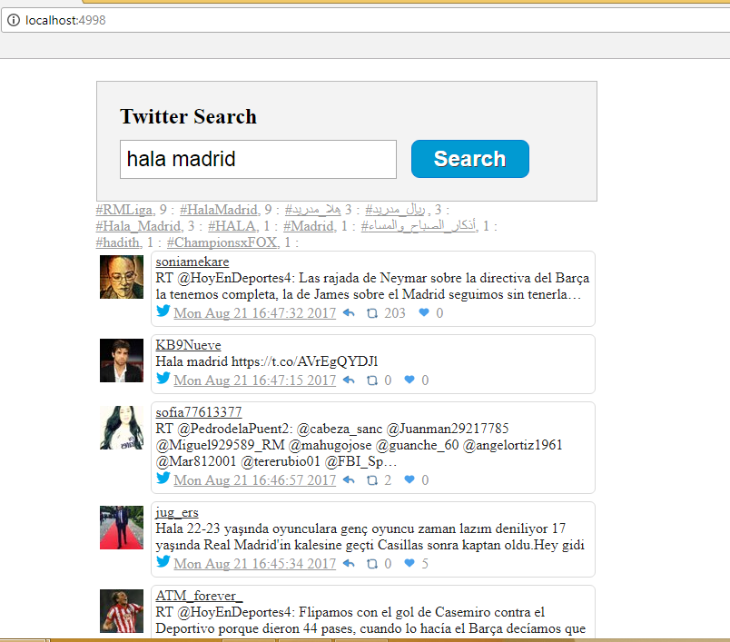

#oAuthTwitterWrapper
This provides a really simple solution to authenticating and wrapping twitter's API calls using the 1.1 API and OAuth.

##Quick installation instructions:

Amend the appsettings to add your consumer key, secret and screen name. [Generate your key and secret here] (https://dev.twitter.com/apps/new)

Add the following code to return the raw json:

            var twit = new OAuthTwitterWrapper.OAuthTwitterWrapper();
            twit.GetSearch();

If you would prefer to use serialiazed C# pocos use the following:

           var twit = new OAuthTwitterWrapper.OAuthTwitterWrapper();
           var json = twit.GetSearch();
           var tweets = JsonConvert.DeserializeObject<Search>(json); // Deserialize with Json.NET

Screen shot below.

## Demo project in GitHub

### Mvc application 
This uses a controller action that returns the json and uses the same method to display them as above.
It makes use of jQuery and this great library [twitter-text] (https://github.com/twitter/twitter-text-js). * Please note that I created this in VS2017.

         
